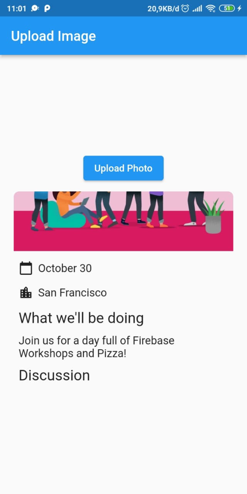
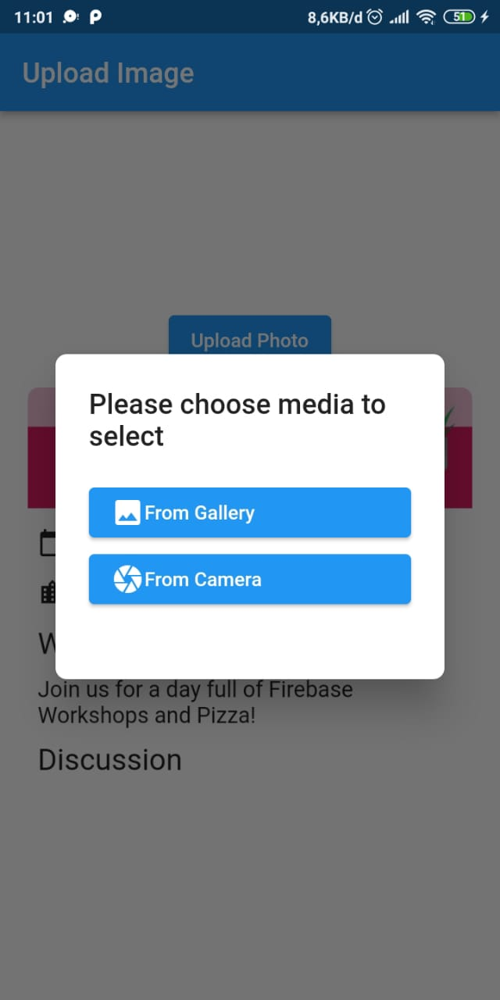
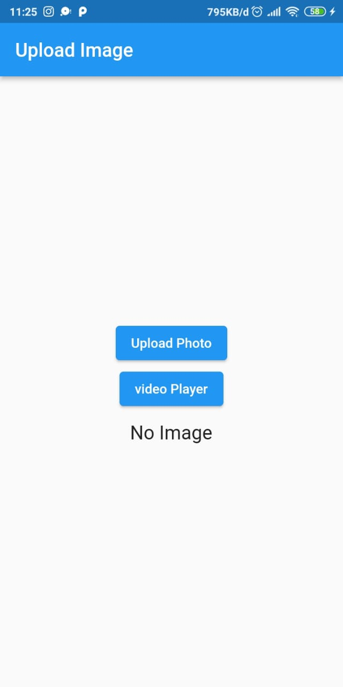
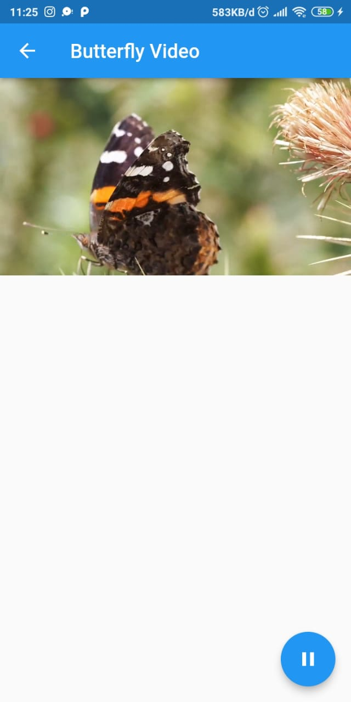

# foto_dan_video

Pada project ini digunakan dua plugin yaitu image_picker dan video_player. image_picker dapat digunakan dengan cara memasukan perintah '$ flutter pub add image_picker' pada terminal. sedangkan video_player dengan cara memasukan perintah '$ flutter pub add video_player'.

## hasil  run image_picker

pada gambar diatas terlihat sebuah button dan gambar yang telah di upload ke aplikasi. untuk memilih gambar tinggal menekan button "upload foto" lalu pilih dari gallery atau camera seperti gambar dibawah

## hasil run video_player
untuk percobaan ini saya menambahkan button "video player" untuk menuju halaman video player.

pada halaman ini terdapat tombol play dan pause untuk video yang ditampilkan

